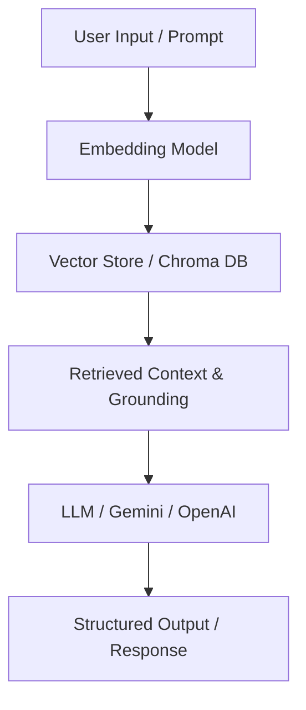

# 📄 RAG Document Q&A System

> Ask questions to any PDF document using AI — powered by LLMs + FAISS

---

## 🧠 What This Does

Upload any PDF. Ask any question. Get accurate answers — instantly.

Built using Retrieval-Augmented Generation (RAG) architecture.

---

## 🏗️ How It Works

```
PDF → Extract Text → Chunk → Embed → Store in FAISS
                                          ↓
             Answer ← LLM ← Top Chunks ← Search
```

## 🛠️ Tech Stack

- Python 3.10+
- LangChain
- HuggingFace Transformers
- FAISS (Vector Search)
- FastAPI

## 🚀 Setup

```bash
git clone https://github.com/YOUR_USERNAME/rag-document-qa
cd rag-document-qa
pip install -r requirements.txt
python src/pdf_loader.py
```

## 📁 Project Structure

```
src/          → All source code
data/         → Your PDF files
tests/        → Test cases
notebooks/    → Experiments
```

## 📐 Architecture & Pipeline



## 👨‍💻 Author

Venkata Sai Karthik Pyla
