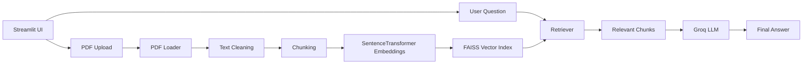

# RAG Document Assistant

An end-to-end Retrieval-Augmented Generation application for asking questions over PDF documents with a Streamlit interface, local embedding generation, FAISS retrieval, and Groq-powered answer generation.

## Overview

The app lets a user upload a PDF, convert the document into overlapping text chunks, generate embeddings for those chunks, store them in a FAISS index, and then answer questions by retrieving the most relevant context and sending it to a Groq chat model.

The repository is structured so the same core pipeline can be used from the Streamlit UI, a command-line pipeline, or future API layers.

## Architecture

## Pipeline Flow

1. The user uploads a PDF in the Streamlit app.
2. `pdf_loader.py` extracts and cleans the text.
3. The text is split into overlapping chunks of about 500 characters.
4. `embeddings.py` generates dense vectors with `all-MiniLM-L6-v2`.
5. `vector_store.py` stores the vectors in a FAISS L2 index.
6. For each question, the retriever finds the top matching chunks.
7. `llm_handler.py` builds a context-grounded prompt and sends it to Groq.
8. The app returns an answer that is constrained to the retrieved document context.

## Repository Structure

- `app.py` - Streamlit user interface and session state orchestration.
- `src/pdf_loader.py` - PDF extraction, cleanup, and chunking.
- `src/embeddings.py` - Embedding generation using SentenceTransformers.
- `src/vector_store.py` - FAISS index creation and similarity search.
- `src/llm_handler.py` - Groq client setup and answer generation.
- `src/rag_pipeline.py` - Command-line pipeline wrapper for end-to-end testing.
- `data/` - Local document storage for development inputs.
- `tests/` - Placeholder for automated tests.
- `notebooks/` - Exploration and experimentation notebooks.

## Tech Stack

- Python 3.10+
- Streamlit for the UI
- pypdf for document parsing
- langchain-text-splitters for chunking
- sentence-transformers for embeddings
- faiss-cpu for vector search
- Groq for chat-completion inference
- python-dotenv for environment variable loading

## Features

- PDF upload and in-browser Q&A.
- Cleaned and chunked document ingestion.
- Local vector indexing with FAISS.
- Context-grounded answers from the retrieved text.
- Session state support for a multi-turn chat experience.
- Reusable pipeline code for scripts and future API integrations.

## Prerequisites

- Python 3.10 or later.
- A Groq API key.
- Optional Hugging Face token if your environment or model access requires one.

## Configuration

Create a local `.env` file in the project root. Do not commit that file to GitHub.

Required variables:

- `GROQ_API_KEY` - used by `src/llm_handler.py`.
- `HUGGINGFACE_TOKEN` - optional, used by `src/embeddings.py` for Hugging Face access.
- `GEMINI_API_KEY` - currently unused by the app, but kept here only if you plan to extend the project later.

You can use `.env.example` as the template and copy it to `.env` locally.

## Setup

1. Create and activate a virtual environment.
2. Install dependencies with `pip install -r requirements.txt`.
3. Add your API keys to `.env`.
4. Run the Streamlit app with `streamlit run app.py`.

## Local Run Commands

Streamlit app:

1. `streamlit run app.py`

Pipeline smoke test from the command line:

1. `python src/rag_pipeline.py`

Embedding or retrieval checks can also be run directly from the helper modules in `src/`.

## Security Notes

- `.env` is ignored by Git and should never be pushed.
- `.env.example` contains placeholders only, so the repository can be shared safely.
- Rotate any API key if it was ever copied into a public channel or committed elsewhere.
- Before pushing, run `git status` and confirm no secret-bearing files are staged.
- Keep documents under `data/` limited to non-sensitive development samples unless you intentionally want them in the repo.

## GitHub Publish Checklist

Use this flow before pushing to GitHub:

1. Verify secrets are ignored with `git check-ignore -v .env`.
2. Confirm no secret files are tracked with `git ls-files | findstr /i ".env"`.
3. Stage the project with `git add .`.
4. Commit with a clear message such as `git commit -m "Complete RAG docs and security hardening"`.
5. Push with `git push origin main`.

If you want to publish to a fresh remote, add the GitHub repository URL first with `git remote add origin <repo-url>`.

## How It Works in Detail

### 1. Document ingestion

`pdf_loader.py` reads each page of the PDF, cleans spacing artifacts introduced by PDF extraction, and merges the result into a single text stream.

### 2. Chunk preparation

The text splitter creates overlapping chunks so the retriever can preserve local context without exceeding embedding limits.

### 3. Embedding generation

`embeddings.py` loads `SentenceTransformer('all-MiniLM-L6-v2')` and turns each chunk into a 384-dimensional vector.

### 4. Vector indexing

`vector_store.py` converts the embeddings into a FAISS `IndexFlatL2` index for fast similarity search.

### 5. Retrieval

For each question, the query is embedded using the same model and the top chunks are returned from FAISS.

### 6. Answer generation

`llm_handler.py` assembles the retrieved chunks into a prompt and sends them to Groq. The model is instructed to answer only from the supplied context.

### 7. Streamlit session flow

`app.py` stores the processed document, chunks, index, and chat history in `st.session_state` so the user can ask multiple questions after one analysis step.

## Development Notes

- The repository also contains reusable command-line entry points in `src/rag_pipeline.py` and module-level smoke tests in the helper files.
- The Streamlit UI currently focuses on a single-document workflow.
- Some dependencies in `requirements.txt` are available for future API expansion, but the main user-facing flow is the Streamlit app.

## Troubleshooting

- If the app says `GROQ_API_KEY is not set`, confirm the `.env` file exists in the project root and contains a valid key.
- If the embedding model download fails, verify network access and any Hugging Face authentication requirements.
- If FAISS import errors appear on Windows, reinstall dependencies inside a clean virtual environment.
- If the app cannot find the uploaded PDF, make sure you are using a PDF file and not another document type.

## License

No explicit license file is included in the repository yet. Add one before publishing publicly if you want to define reuse terms.
